## Hệ thống tuyển sinh thông minh đánh giá hồ sơ năng lực học sinh

### Chuẩn bị cần thiết:
  1. Môi trường: Linux >= 18.0.4
  2. Cài đặt Docker:
  ```bash
  $ sudo apt-get update
  $ sudo apt-get install ca-certificates curl
  $ sudo install -m 0755 -d /etc/apt/keyrings
  $ sudo curl -fsSL https://download.docker.com/linux/ubuntu/gpg -o /etc/apt/keyrings/docker.asc
  $ sudo chmod a+r /etc/apt/keyrings/docker.asc

  $ echo \
      "deb [arch=$(dpkg --print-architecture) signed-by=/etc/apt/keyrings/docker.asc] https://download.docker.com/linux/ubuntu \
      $(. /etc/os-release && echo "${UBUNTU_CODENAME:-$VERSION_CODENAME}") stable" | \
      sudo tee /etc/apt/sources.list.d/docker.list > /dev/null
  $ sudo apt-get update
  ```
  3. Cấp quyền cho docker và tạo docker group
  ```bash
  $ sudo groupadd docker
  $ sudo usermod -aG docker $USER
  $ newgrp docker
  ```

### Khởi chạy dự án 
1. Truy cập vào thư mục cha `soai/`.
2. Khởi động docker container và build docker image
  ```bash
  $ docker compose up -d --build
  ```
3. Chờ lệnh chạy xong và mở ra 2 trình duyệt bình thường và ẩn danh.
**Notes**: Trình duyệt ẩn danh giúp không lưu cache và cookie nên mở riêng biệt ra để đăng nhập tài khoản cho USER để vào page nộp hồ sơ tuyển dụng: `localhost:8080`.
- Tạo tài khoản: `user/User@123`.

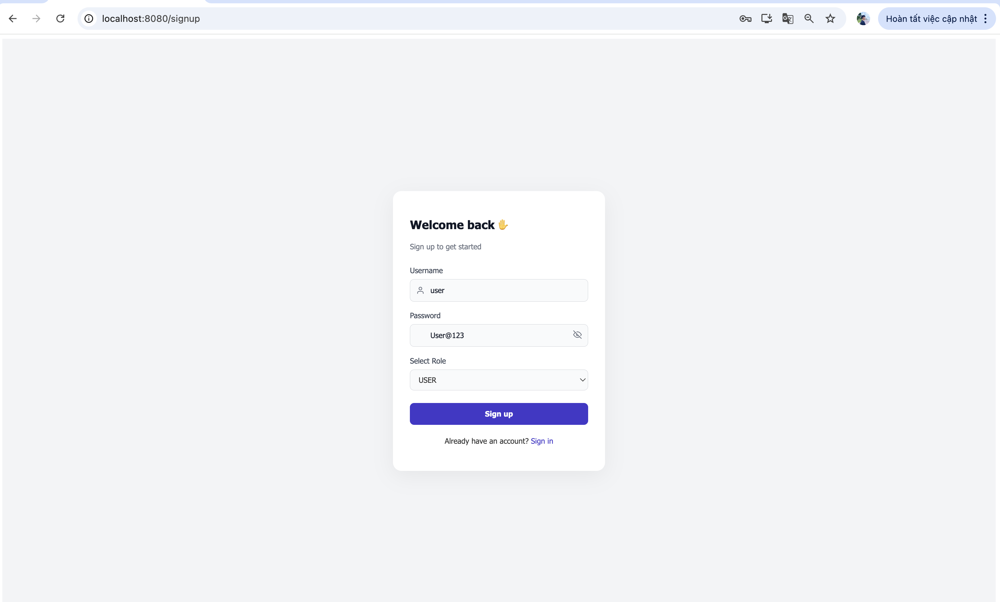

Mở 1 trình duyệt ẩn danh
- Đăng nhập bằng tài khoản admin: `admin/Admin@123`

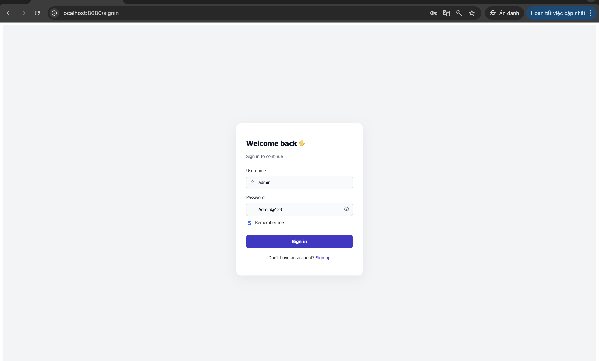

4. Mở trang ADMIN đã đăng nhập lên và tiến hành tải mô tả thông tin tuyển sinh ở `backend/services/recruitment_agent/tests/test_data/jd_sample.json`.

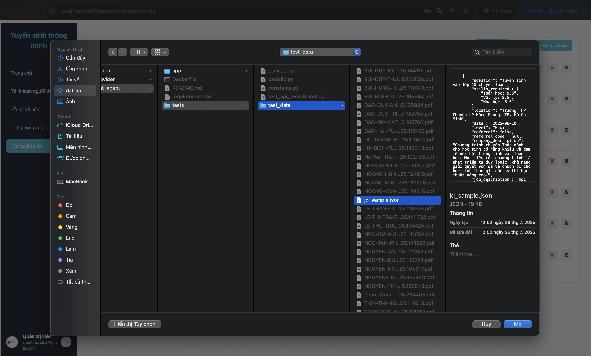

Thông tin toàn bộ mô tả được hiển thị trên trang USER để nộp hồ sơ năng lực học sinh.

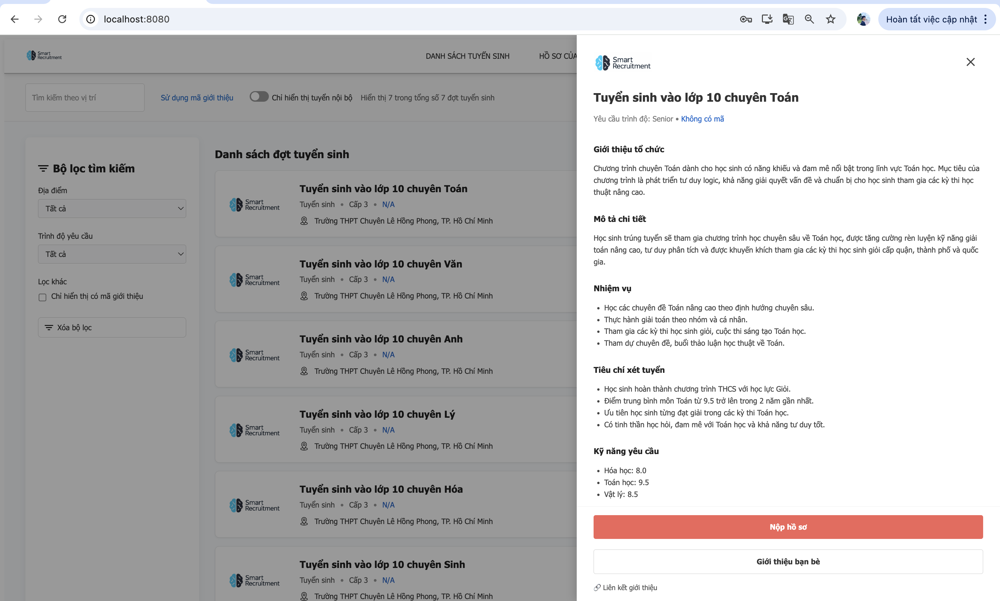

5. Tiến hành nộp hồ sơ năng lực học sinh ở thư mục `backend/services/recruitment_agent/tests/`

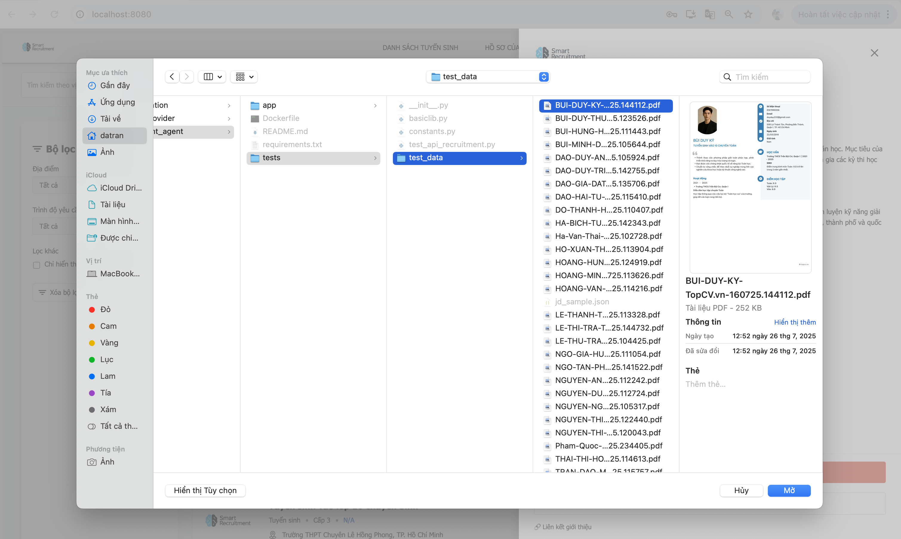

Hồ sơ nộp được xử lý. Quản trị viên có thể xem và xem ứng viên có phù hợp với mô tả tuyển sinh hay không.

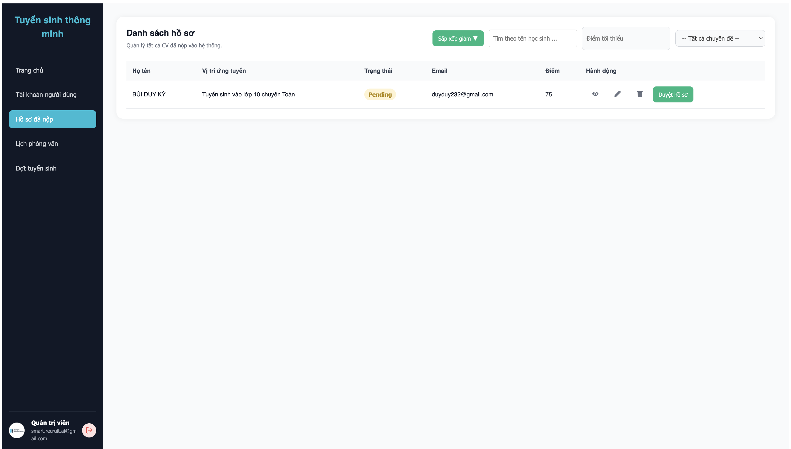

Hồ sơ ứng viên có thể bổ sung chứng chỉ và chứng minh thông qua phần hồ sơ của tôi.

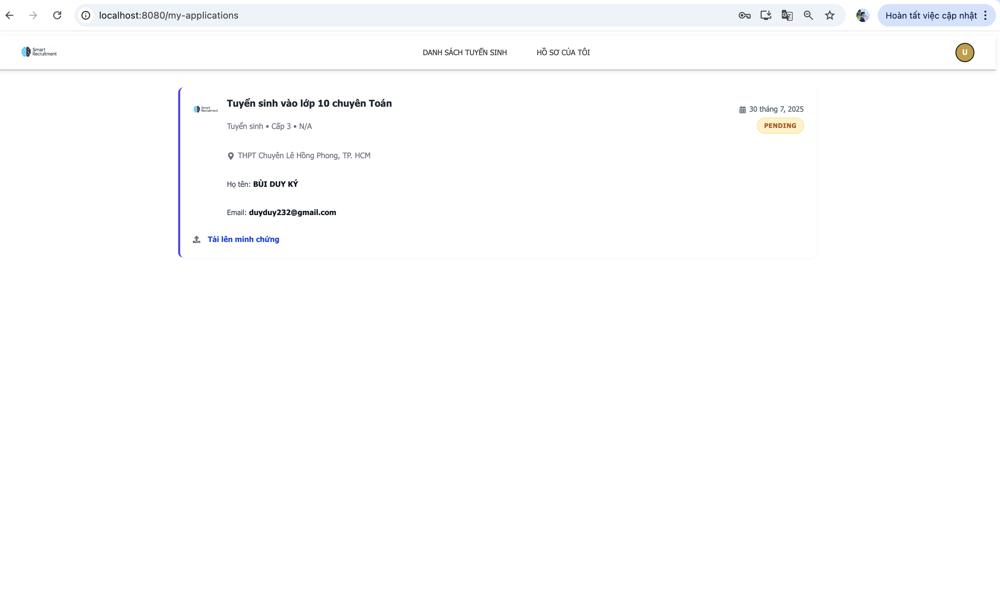

6. Quản trị viên có thể đặt lịch phỏng vấn với ứng viên khi mà chưa đủ chỉ tiêu

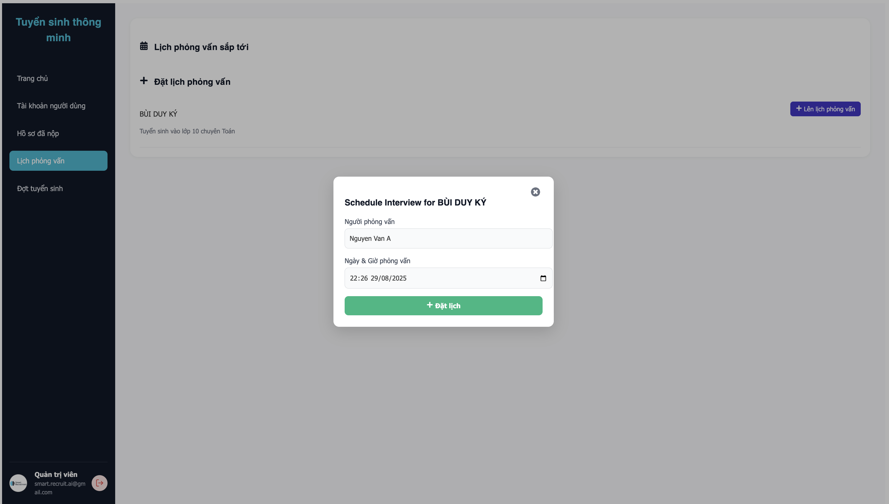

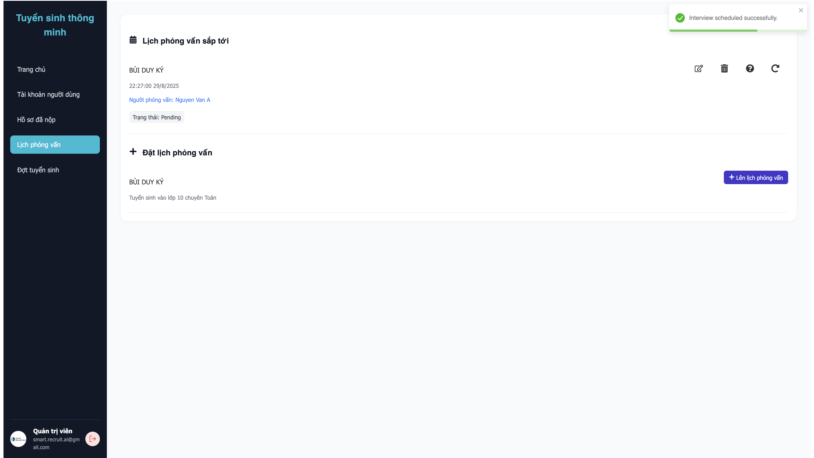

7. Khi ứng viên chấp nhận phỏng vấn và câu hỏi sẽ được tự động sinh ra cho phần lịch hẹn được suôn sẻ hơn.

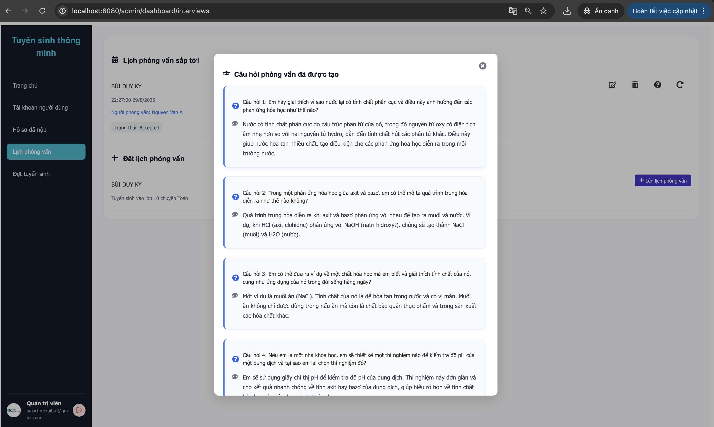

8. Khi quản trị viên chấp nhận hồ sơ và email được gửi về cho ứng viên.

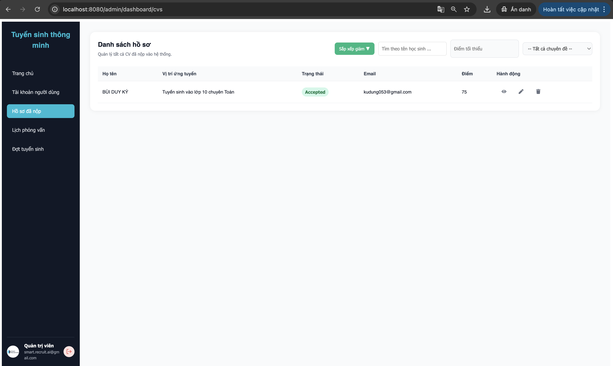

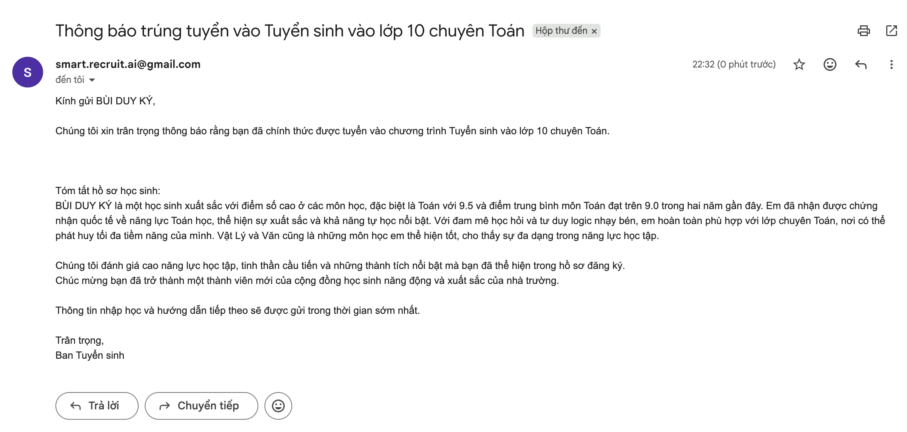

